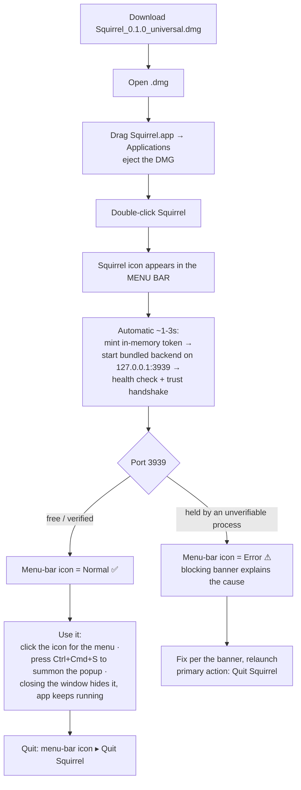

# Installing Squirrel on macOS

Squirrel is distributed as a **signed and notarized** universal app (arm64 + x86_64).
You can open it like any other Mac app — no Gatekeeper warning, no bypass needed.

> **Note:** Squirrel runs as a **menu-bar app — no Dock icon, no auto-opening
> window**. After launch, look in the menu bar (top-right).

## Install flow at a glance



## Step 1 — Drag to Applications

1. Open the downloaded `.dmg` file.
2. Drag `Squirrel.app` to your `Applications` folder.
3. Eject the DMG.

## Step 2 — Launch

Double-click `Squirrel.app`. It opens without a Gatekeeper warning.

Squirrel does not pop a window — it lives in the **menu bar**. Within a second
or two of launch it:

1. Mints a one-time secret token (held in memory, never written to disk).
2. Starts its bundled backend on `127.0.0.1:3939` authenticated with that token.
3. Health-checks it and settles the menu-bar icon into its **Normal** state.

Then:

- Click the menu-bar icon for the menu (*Open Squirrel*, *Open Web UI*, etc.)
- Press **`Ctrl+Cmd+S`** from any app to summon the popup window.
- Closing the window **hides** it — the app keeps running in the menu bar.
- **Quit** via the menu-bar icon ▸ **Quit Squirrel**.

### If the icon shows an error instead

If something is already using port `3939` that Squirrel can't verify, it refuses
to talk to it and shows a full-window banner with the cause and the fix.

| Banner cause | Meaning | Fix |
|---|---|---|
| **Another program is using port 3939** | An unverifiable process holds the port | `lsof -i :3939`, quit it, relaunch |
| **A development backend is running** | An unauthenticated dev backend (e.g. `make backend-start`) | Quit the dev backend and relaunch, or quit Squirrel and use the CLI |
| **The backend isn't responding** | The process didn't answer in time | Wait ~30 s and relaunch; if it persists check `~/.squirrel/web-ui.stderr.log` |
| **The launch token is invalid** | `~/.squirrel/launchd-token` is missing / wrong perms / malformed | Run `install.sh --reinstall`, then relaunch |

The full security model is in [`docs/hld/runtime-trust-handshake.md`](hld/runtime-trust-handshake.md).

### Optional — start automatically at login

By default Squirrel owns its own backend per launch. To instead run the backend
at login under launchd (Squirrel then *adopts* it after verifying):

```bash
bash apps/backend/launchd/install.sh             # install + provision token
bash apps/backend/launchd/install.sh --reinstall # rotate token + re-bootstrap
bash apps/backend/launchd/install.sh --uninstall # remove auto-start
```

## Where Squirrel lives after install

| Path | What it is |
|---|---|
| `/Applications/Squirrel.app` | The app itself |
| `~/.squirrel/config.toml` | Your vault configuration |
| `~/.squirrel/squirrel.log` | Tauri-side log (tray, supervisor, deep links) |
| `~/.squirrel/web-ui.log` | Backend HTTP request log (rotates at 10MB) |
| `~/.squirrel/state/squirrel.db` | Notifications database |
| `~/.squirrel/launchd-token` | Trust token (only if you ran the launchd installer); mode `0600` |

If the tray icon goes red and the menu says **"Backend unavailable — see
~/.squirrel/squirrel.log"**, that log file is the first place to look.

## Uninstall

```bash
# Quit Squirrel from the tray menu first, then:
rm -rf /Applications/Squirrel.app
rm -rf ~/.squirrel
```

---

## Installing legacy unsigned builds

> **This section applies only to builds predating the signing release.**
> If you downloaded a recent `.dmg` from the releases page, use the steps
> above — no bypass is needed.

Older Squirrel `.dmg` files were distributed unsigned. macOS blocks the first
launch with a Gatekeeper warning. This is a one-time bypass per machine.

### Option A — Right-click → Open  (fastest)

1. In Finder, find `Squirrel.app` in `/Applications`.
2. **Right-click** (or Control-click) the app → **Open**.
3. A new dialog appears with an **Open** button (note: this dialog does NOT
   appear if you double-click — it only appears via the right-click path).
4. Click **Open**.

Squirrel launches. You will never see the warning again on this machine.

### Option B — System Settings → Privacy & Security

1. Open **System Settings** → **Privacy & Security**.
2. Scroll down to the **Security** section.
3. You'll see: *"Squirrel" was blocked from use because it is not from an
   identified developer.*
4. Click **Open Anyway** next to that message.
5. Confirm with your password / Touch ID.

Squirrel launches. You will never see the warning again on this machine.
