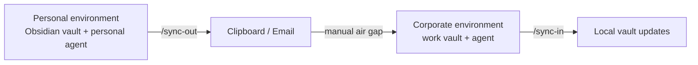

# Context Bridge — Architectural Analysis

> Markdown-based, multi-agent context and task management for Claude Code, Codex, Cursor, and similar agents, with a manual air gap between personal and corporate environments via copy/paste or email.

---

## Problem it solves

For an engineer with ADHD working across multiple projects:

1. Context gets lost when switching tasks, days, or projects.
2. LLM agents remember nothing between sessions.
3. Corporate and personal environments must stay separated.
4. Different agents use different formats and integrations.
5. Side projects accumulate finishing tax and never ship.
6. Decisions and research disappear unless they are captured.

## Design principles

### 1. Markdown-first
- State lives in `.md` files on disk, not in databases or the cloud.
- Works offline on any OS and in any editor.
- Compatible with Obsidian, Logseq, VSCode, vim, and cat.

### 2. Air gap by design
- No automatic sync between environments.
- Transfer happens through signed Markdown blocks that the user copy/pastes or emails.
- Each block is self-contained, idempotent, and auditable.

### 3. Agent-agnostic
- The plugin is implemented as portable Agent Skills.
- Skills are Markdown files with YAML frontmatter, so they work in any agent that supports the pattern.
- One core skill set, with lightweight per-agent adapters.

### 4. Proactive, not passive
- Skills trigger automatically on session start, session end, decisions, or blockages.
- Hooks detect events like file edits or user prompts and suggest capture.
- The plugin asks questions instead of waiting.

### 5. Semantic tags as glue
- A `PROJECT-SUBAREA-COMPONENT-NNN` tag scheme keeps everything connected.
- Sessions, decisions, side notes, and blocks all receive tags.
- Search and traceability work across vault ↔ sessions ↔ commits.

## High-level architecture



No byte crosses the air gap unless the user explicitly decides it should.

## Plugin components

### Skills
Skills are the portable core. Each `SKILL.md` is loaded automatically when the context matches.

- `squirrel:capture` captures notes, decisions, and context into the vault.
- `squirrel:session-start` loads the latest shutdown note and summarizes what to resume.
- `squirrel:session-end` writes a shutdown note with next physical action, hypotheses, and blockers.
- `squirrel:brief` returns a structured six-part status summary.
- `squirrel:decision` records a lightweight ADR.
- `squirrel:sync-out` generates a signed package for another environment.
- `squirrel:sync-in` validates, diffs, and applies a received package.

### Commands
Slash commands provide explicit entry points:

| Command | Function |
|---|---|
| `/sq-start [PROJECT-TAG]` | Start a project session and load context |
| `/sq-end` | Close the session and write a shutdown note |
| `/sq-brief [PROJECT-TAG]` | Produce a structured status brief |
| `/sq-decision` | Capture an architectural decision |
| `/sq-capture` | Capture a quick note or context |
| `/sq-sync-out [--scope=...]` | Generate a package for another environment |
| `/sq-sync-in` | Process a pasted package |
| `/sq-where-am-i` | Show the latest context and next step |
| `/sq-status` | Show global vault state |

### Hooks
Hooks make the system proactive:

| Hook | Trigger | Action |
|---|---|---|
| `SessionStart` | Session begins | Runs `session-start` automatically |
| `PreToolUse:Write` | Before writing a file | Checks whether context should be captured |
| `PostToolUse:Edit` | After editing | Suggests updating the shutdown note |
| `UserPromptSubmit` | User sends a message | Detects decision language and prompts capture |
| `Stop` | Session ends | Runs `session-end` automatically |

### Agents
Specialized sub-agents handle focused tasks:

- `squirrel:summarizer` generates the structured brief.
- `squirrel:tagger` assigns semantic tags.
- `squirrel:reviewer` checks sync-in packages before applying them.

### MCP server
An optional local MCP server exposes:

- `vault.read(tag)`, `vault.write(tag, content)`, `vault.search(query)`
- `vault.link(from, to)`
- `vault.list_wip()`, `vault.list_parking()`
- `package.create(scope)`, `package.apply(content)`

It reads `~/.squirrel/config.toml` to discover the vault and active projects.

## Package protocol

Everything that crosses the air gap uses a signed Markdown package.

```markdown
<!-- CONTEXT-BRIDGE-PACKAGE v1 -->
<!--
  from: personal
  to: work
  generated_at: 2026-05-23T19:30:00Z
  scope:
    - SIDEPROJECT-FOYER-FAMILY:research/*
    - LEARNING-LIBRO-DDIA:cap-3
  hash: sha256:a3f5b8c9...
  intent: research-results-for-work-context
-->

## Notes to apply

### SIDEPROJECT-FOYER-FAMILY-RESEARCH-001
**Tag**: `SIDEPROJECT-FOYER-FAMILY-RESEARCH-001`
**Type**: research-note
**Operation**: create
**Vault target**: `~/vault-tdah/01-Proyectos-Activos/SIDEPROJECT-FOYER-FAMILY/`

---
id: SIDEPROJECT-FOYER-FAMILY-RESEARCH-001
proyecto: SIDEPROJECT-FOYER-FAMILY
estado: done
creado: 2026-05-23
tags: [intent, research, area/side-project]
---

# Research: DB comparison for v2

## Findings
- Supabase: free tier is enough, but concurrent connections are limited.
- Turso: edge-native, better global latency, but a steeper learning curve.
- PlanetScale: more mature, but expensive.

## Recommendation
Use Supabase for v1. Move to Turso if we reach 5k+ active users.

## References
- [link 1]
- [link 2]

<!-- /CONTEXT-BRIDGE-PACKAGE -->
```

### Rules

1. HTML comment header keeps the block invisible in rendered Markdown but parseable.
2. The integrity hash catches truncation or corruption.
3. Scope is explicit.
4. The declared operation is one of `create`, `update`, `merge`, or `append`.
5. Frontmatter is preserved.
6. Applying the same package twice is idempotent.
7. The sync-in skill writes an audit log in `.squirrel/applied/`.

## Use cases

### 1. Personal research → work use
At home, you research a work-related decision, generate a package with `/sq-sync-out`, and email it to yourself. At work, you paste it into the agent, verify the hash, review the diff, and apply it locally.

### 2. Brief for tomorrow
At the end of the day, `/sq-end` writes a shutdown note with the current state, next physical action, and active hypothesis. The next morning, `/sq-start` restores the context and points directly at the next action.

### 3. Proactive decision capture
When you say things like “I’m going to use Redis instead of Postgres,” the decision skill captures a lightweight ADR with context, alternatives, rationale, and consequences.

### 4. “What was I doing?”
`/sq-where-am-i` summarizes the active WIP projects, their current state, and the one concrete next step that matters most.

## Repository structure

```text
squirrel/
├── .claude-plugin/plugin.json
├── codex-plugin.toml
├── README.md
├── ARCHITECTURE.md
├── INSTALL.md
├── skills/
├── commands/
├── hooks/
├── templates/
├── lib/
├── config/
└── examples/
```

## Agent installation model

- Claude Code reads the plugin manifest directly.
- Codex uses copied or symlinked skills and commands plus a patched `AGENTS.md`.
- Cursor/VSCode uses `~/.cursor/rules/` and task-based integrations.
- Any other Markdown-capable agent can use the `skills/` directory directly.

## Security considerations

### Real air gap
- The plugin never makes network requests between environments.
- It never reads `~/.ssh`, credentials, or sensitive environment files.
- Everything that crosses the gap goes through a human.

### Package scope
- `sync-out` declares the files it includes.
- The user confirms before generating.
- The package is readable plain text, so it can be reviewed before being pasted on the other side.
